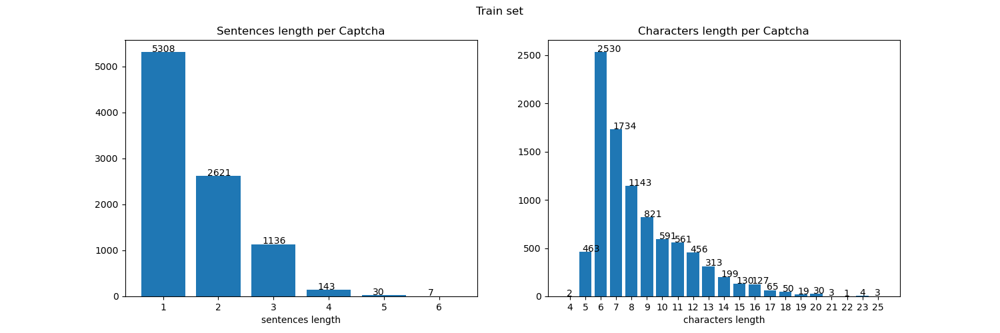
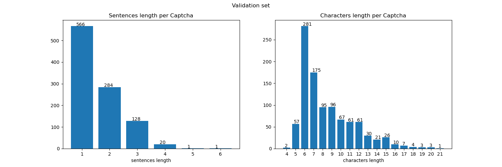
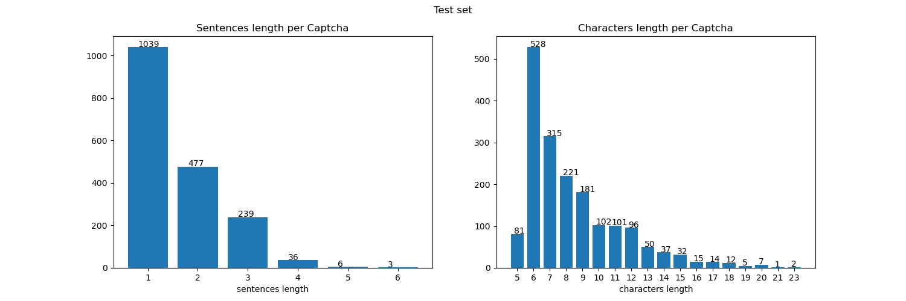

## Acknowledgements
This is a slightly modified version of [deep-text-recognition-benchmark](https://github.com/clovaai/deep-text-recognition-benchmark)

```
@inproceedings{baek2019STRcomparisons,
  title={What Is Wrong With Scene Text Recognition Model Comparisons? Dataset and Model Analysis},
  author={Baek, Jeonghun and Kim, Geewook and Lee, Junyeop and Park, Sungrae and Han, Dongyoon and Yun, Sangdoo and Oh, Seong Joon and Lee, Hwalsuk},
  booktitle = {International Conference on Computer Vision (ICCV)},
  year={2019},
  note={to appear},
  pubstate={published},
  tppubtype={inproceedings}
}
```

## Dataset
Download our dataset from [here](https://drive.google.com/open?id=18DzwCR3fLNpZEih1MfWqWXz1mXX3GrwS)
* raw_datasets contains:
  * train.txt / test.txt / val.txt which are the alignment of captchas (their filename) with their respective labels
  * train_unconstrained_14k245.txt which contains the alignment of 14k245 (5k unconstrained captchas merged with thr 9245 constrained training set captchas) captchas for training with their respective labels.
  * train_unconstrained_19k245.txt which contains the alignment of 19k245 (10k unconstrained captchas merged the 9245 constrained training set captchas) captchas for training with their respective labels.
  * train_letters.txt which contains the letters available in the training data
  * ood_gts.txt which are the alignment of captchas  with their respective labels for the Out-Of-Domain test set
  * train folder which contains the training
  * val folder which contains the training
  * train_unconstrained folder which contains the unconstrained training captchas
  * test which folder which contains test captchas
  * ood_captchas which contains the Out-Of-Domain test captchas
  
* datasets_lmdb contains:
  * train_constrained which contains the ready to use training lmdb dataset
  * train_unconstrained_14k245 which contains the ready to use 14k245 unconstrained training lmdb dataset
  * train_unconstrained_19k245 which contains the ready to use 19k245 unconstrained training lmdb dataset
  * val which contains the ready to use validation lmdb dataset
  
### Datasets stats
<p float="left">
  
  
   
  
  
</p>

### Create your own dataset
```
python3 create_lmdb_dataset.py --inputPath path_to_image_folder --gtFile path_to_gt_file.txt --outputPath path_to_output_folder
```
* --inputPath: path to the folder containing the images
* --path_to_gt_file: path to the alignment file which is in the following format: {imagepath}\t{label}\n
* --outputPath: path of the output folder

## Our pretrained models
Download pretrained model from [here](https://drive.google.com/open?id=1nTP0ZOm97qSKlr8RpZUXXpgKWMH7bSQt). You can get more information about the model used by reading [this](https://arxiv.org/abs/1904.01906) paper.

The drive link contains those pretrained models:
  * TPS-ResNet-BiLSTM-Attn : full implementation of the model presented in the paper above
  * resnet_34_frozen_pretrained_constrained : model using PyTorch ResNet34 as the feature extractor with frozen parameters and trained on a constrained dataset
  * resnet_34_finetuned_pretrained_constrained : model using PyTorch ResNet34 as the feature extractor with finetuned parameters and trained on a constrained dataset
  * resnet_34_finetuned_pretrained_unconstrained_10k : model using PyTorch ResNet34 as the feature extractor with finetuned parameters and trained on an unconstrained dataset which contains 10k data
  * resnet_34_finetuned_pretrained_unconstrained_15k : model using PyTorch ResNet34 as the feature extractor with finetuned parameters and trained on an unconstrained dataset which contains 15k data
  
### models results on test set
<table>
<tr>
  <th>Models</th>
  <th>Total accuracy</th>
  <th>One word accuracy</th>
  <th>Two word + accuracy</th>
</tr>
<tr>
  <th scope="row">TPS-ResNet-BiLSTM-Attn</th>
  <td><center>8.38</center></td>
  <td><center>14.53</center></td>
  <td><center>0.0</center></td>
</tr>
<tr>
  <th scope="row">resnet_34_frozen_pretrained_constrained</th>
  <td><center>0</center></td>
  <td><center>0</center></td>
  <td><center>0</center></td>
</tr>
<tr>
  <th scope="row">resnet_34_finetuned_pretrained_constrained</th>
  <td><center>49.61</center></td>
  <td><center>58.22</center></td>
  <td><center>37.84</center></td>
</tr>
<tr>
  <th scope="row">resnet_34_finetuned_pretrained_unconstrained_14k245</th>
  <td><center>55.16</center></td>
  <td><center>62.36</center></td>
  <td><center>45.33</center></td>
</tr>
<tr>
  <th scope="row">resnet_34_finetuned_pretrained_unconstrained_19k245</th>
  <td><center>55.72</center></td>
  <td><center>63.81</center></td>
  <td><center>39.94</center></td>
</tr>
</table>
<br/>

Our models have 0% accuracy on the Out-Of-Domaine (OOD) daatset except for the 'TPS-ResNet-BiLSTM-Attn' model which is at 10.39% accuracy

## Train and Test models

### Train
  * resnet_34_frozen_pretrained : 
```
CUDA_VISIBLE_DEVICES=0 python3 train.py \
--train_data path_to_lmdb_train_folder --valid_data path_to_lmdb_validation_folder \
--select_data '/' --batch_ratio 1  --character "krosdgtupweavih lcmnbyzjxfq?,'!-.&" \
--Transformation TPS --FeatureExtraction ResNet_PyTorch --SequenceModeling BiLSTM --Prediction Attn \
--batch_size 64 --valInterval {79} \
--imgH 224 --imgW 224 --rgb \
--early_stopping_param 'accuracy' --early_stopping_patience 20 \
--freeze_FeatureExtraction \
--experiment_name my_experiment \
--ignore_x_vals 10
```
  * resnet_34_finetuned_pretrained :
 ```
CUDA_VISIBLE_DEVICES=0 python3 train.py \
--train_data path_to_lmdb_train_folder --valid_data path_to_lmdb_validation_folder \
--select_data '/' --batch_ratio 1  --character "krosdgtupweavih lcmnbyzjxfq?,'!-.&" \
--Transformation TPS --FeatureExtraction ResNet_PyTorch --SequenceModeling BiLSTM --Prediction Attn \
--batch_size 64 --valInterval {79} \
--imgH 224 --imgW 224 --rgb \
--early_stopping_param 'accuracy' --early_stopping_patience 20 \
--experiment_name my_experiment \
--ignore_x_vals 10
```

### Test
You should put all your images that you want to test in a 'your_image_folder/' then run:
```
CUDA_VISIBLE_DEVICES=0 python3 demo.py \
--Transformation TPS --FeatureExtraction ResNet_PyTorch --SequenceModeling BiLSTM --Prediction Attn \
--image_folder your_image_folder/ \
--character "krosdgtupweavih lcmnbyzjxfq?,'!-.&" \
--imgH 224 --imgW 224 --rgb \
--saved_model path_to_your_pretrained_model
```
Note: You have to use the same configuration as the model that you've trained !

### Parameters

* --train_data: path to the lmdb folder containing the training data
* --valid_data: path to the lmdb folder containing the validation data
* --select_data: '/' for personnal dataset
* --batch_ratio: 1 for personnal dataset
* --character: string containing all the characters of your dataset
* --Transformation: select Transformation module [None | TPS].
* --FeatureExtraction: the feature extractor model  [VGG | RCNN | ResNet | ResNet_PyTorch]
* --freeze_FeatureExtraction: Freeze the ResNet_PyTorch feature extractor's parameters
* --valInterval: the number of iteration before each 
* --imgH: height of your images
* --imgW: width of your images
* --early_stopping_param: early stopping parameter [accuracy|loss]
* --early_stopping_patience: patience of early stopping
* --ignore_x_vals: number of iteration to skip before the first validation

There are much more parameter available, check the train.py / test.py / demo.py files

